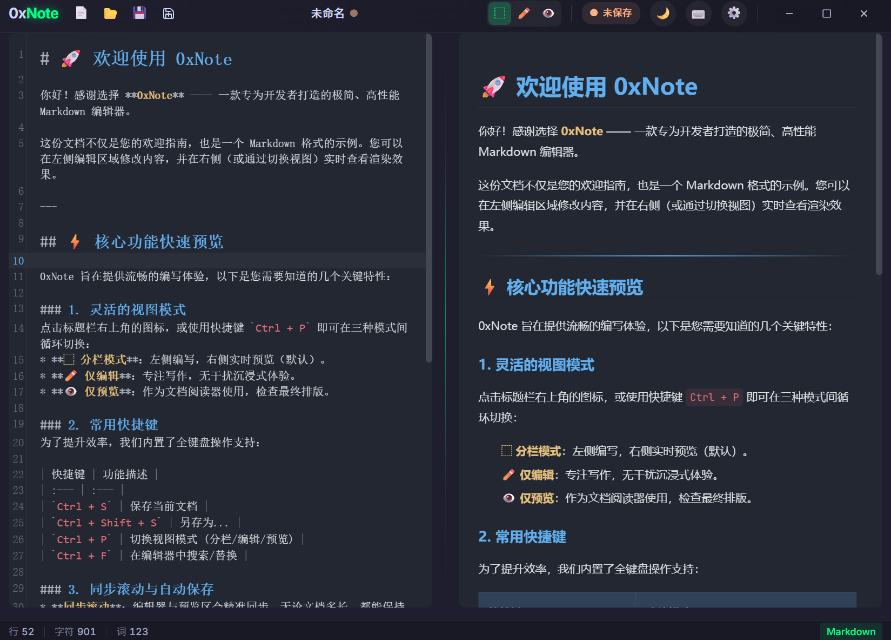

<h1 align="center"> 🚀 0xNote ( Markdown 编辑器)</h1>

<p align="center">
  
</p>

<p align="center">
  <strong>轻量级 Markdown 编辑器 | Windows 右键菜单集成 | 实时预览 | 专业代码高亮</strong>
</p>

<p align="center">
  
  
  
  
  
  
</p>

---

## 📖 简介

**0xNote** 是一款专为开发者设计的极简 Markdown 编辑器，拥有现代化的 UI 和流畅的编写体验。

---

## 🖥️ 主页展示

<p align="center">
  
</p>

---

## ✨ 核心特性

| 功能                | 描述                                                               |
| ------------------- | ------------------------------------------------------------------ |
| 🎨 **多款精美主题** | 内置 6 款精心设计的主题，支持深色/亮色模式自动切换，平滑过渡体验   |
| 👁️ **实时预览**     | 双栏分屏布局，左侧编写右侧实时预览，所见即所得                     |
| 📝 **专业编辑器**   | 基于 CodeMirror 6，支持语法高亮、自动换行、行号、代码折叠          |
| ⚡ **极速启动**     | 毫秒级冷启动，拒绝臃肿，专注效率                                   |
| 💾 **智能保存**     | 支持自动保存（可配置）、手动保存 (Ctrl+S) 及另存为 (Ctrl+Shift+S)  |
| 🔄 **同步滚动**     | 编辑器与预览区精准同步滚动，支持开关，完美保持阅读进度             |
| 🔄 **自动刷新**     | 外部修改文件后毫秒级同步，并保持当前浏览位置                       |
| 🖱️ **右键菜单集成** | 文件夹空白处右键「新建 Markdown 文档」，文件右键「用 0xNote 打开」 |
| ⚙️ **灵活配置**     | 字体、字号、主题、Tab 大小、自动保存延迟均可实时调整               |
| ⌨️ **丰富快捷键**   | 全键盘操作支持，提升写作效率                                       |

---

### 🖼️ 视图模式

标题栏右上角提供三种视图模式切换 (Ctrl+P)：

| 模式     | 图标 | 场景               |
| -------- | ---- | ------------------ |
| 分栏模式 | ⬚    | 边写边看，实时预览 |
| 仅编辑   | ✏️   | 专注写作，沉浸体验 |
| 仅预览   | 👁️   | 文档阅读，检查排版 |

---

## 🛠️ 开发指南

## 环境要求

| 依赖    | 版本  |
| ------- | ----- |
| Node.js | >= 20 |
| npm     | >= 9  |

## 🛡️ 技术栈

| 分类          | 技术                    | 版本       |
| ------------- | ----------------------- | ---------- |
| 前端框架      | Vue 3 (Composition API) | 3.5+       |
| 类型系统      | TypeScript              | 5.9+       |
| 构建工具      | Vite                    | 7.3+       |
| 状态管理      | Pinia                   | 3.0+       |
| 代码编辑器    | CodeMirror 6            | 6.0+       |
| Markdown 渲染 | markdown-it + DOMPurify | 14.x / 3.x |
| 桌面框架      | Electron                | 40+        |
| 安装打包      | electron-builder + NSIS | 26+        |

---

## 📁 项目结构

```
0xNote/
├── src/
│   ├── common/                # 通用逻辑 (纯 TS，无 UI 依赖)
│   │   ├── types/             # 核心接口定义 (IFileSystem, IWindow...)
│   │   └── editor/            # 编辑器配置 (主题, CodeMirror 扩展)
│   │
│   ├── platforms/             # 跨端适配层 (Bridge Pattern)
│   │   ├── adapter.ts         # 统一适配器入口
│   │   └── windows/           # Windows 平台具体实现
│   │
│   ├── components/            # Vue UI 组件
│   │   ├── MemoEditor.vue     # 核心编辑器 (CodeMirror 6 封装)
│   │   ├── MemoPreview.vue    # 实时预览 (Markdown-it + DOMPurify)
│   │   ├── TitleBar.vue       # 自定义无边框标题栏
│   │   ├── StatusBar.vue      # 底部状态栏 (字数统计, 编码)
│   │   ├── SettingsModal.vue  # 设置面板
│   │   └── ShortcutsModal.vue # 快捷键速查面板
│   │
│   ├── stores/                # Pinia 状态管理
│   │   ├── fileStore.ts       # 文件 I/O 与内容管理
│   │   ├── appStore.ts        # 视图模式与应用状态
│   │   └── settingStore.ts    # 用户偏好持久化
│   │
│   └── App.vue                # 应用根组件 (布局协调)
│
├── electron/                  # Electron 主进程环境
│   ├── main.ts                # 主进程入口 (窗口管理, IPC)
│   ├── preload.ts             # 预加载脚本 (安全桥接)
│   ├── registry.ts            # Windows 注册表集成 (右键菜单)
│   └── installer.nsh          # NSIS 安装脚本扩展
│
└── release/                   # build构建产物
```

---

## 🚀 快速开始 (Getting Started)

### 克隆项目

```bash
git clone https://github.com/yeflyleaf/0xNote.git
```

### 进入项目目录

```bash
cd 0xNote
```

### 安装依赖

```bash
npm install
```

### 启动 Electron 开发模式（推荐）

```bash
npm run electron:dev
```

### 构建

```bash
npm run build:win
```

```bash
npm run build:mac
```

```bash
npm run build:linux
```

构建产物输出到 `release/` 目录。

---

## 📄 许可证 (License)

本项目采用 [AGPL-3.0](LICENSE) 许可证。

Copyright © 2026-Present [yeflyleaf](https://github.com/yeflyleaf). All Rights Reserved.
